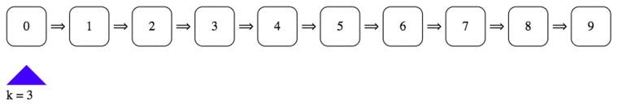

For the past couple of months I have been interviewing for frontend engineering roles in the Bay Area. As anyone who has experienced this process knows, the interview questions can feel arbitrary and the amount of knowledge we are expected to have at hand is vast. Questions can range from data structures/algorithms (DS/A from now on) to CSS trivia. When preparing for an upcoming interview, it feels like we’re being asked to commit all of MDN to memory. Add to this the fact that most interview prep materials are focused on CS fundamentals and the frontend engineering interview can seem hopelessly daunting.

In what will be a series of posts, I am going to outline my approach to preparing for frontend interviews. The underlying idea has been to take a DS/A question and transpose it into a question involving the DOM. Because the DOM is a tree, it maps very naturally to certain data structures: graphs (the superclass of trees), linked lists (a subclass of trees — specifically a unary tree), and trees themselves. With a little creativity, any question can be turned into a frontend question.

I will be working through all of these examples in Vanilla JS. Frequently in interviews we are asked to do some DOM manipulation but we don’t have time to drop in our favorite framework (and all the build tools that might come along with it). This can be tough, since for most of us the average day at work consists of writing very little Vanilla JS. We’re writing React, Angular, Vue, etc. Getting some practice writing pure JS ahead of time can make a world of difference when an interview rolls around, and now that cross-browser compatibility issues are (mostly) a thing of the past, it’s good to have these tricks up your sleeve.

Let’s get to it.

**Question:** Return the *kth* to last element of a singly linked list.

The first step when transposing a DS/A question to a frontend question is finding a sensible way to represent the data in the DOM. There are a few different ways we could represent a linked list. Because a linked list is a unary tree, the most natural would be to create a hierarchical structure of nodes where each parent has one child. This is a great approach, but we’re going to head in a slightly different direction because it will make it easier to add some simple styling.

**Frontend Question: **Change the background color of the *kth* to last sibling element. *Because we are trying to emulate a linked list, we will impose the constraint that we only have access to the `nextElementSibling` method of each node (along with inline styling).*

There are quite a few ways to approach this problem. It’s always a good idea to brainstorm a little bit before immediately jumping into coding up a solution. There’s a pretty strong possibility that the first thing that comes into our head isn’t the best solution. Some possibilities:

1. Go through and turn the linked list into a doubly linked list, then go in reverse order while counting to k.

1. Go through and see how long our linked list is. Cycle through again and stop at `length — k`.

1. Linked lists have a naturally recursive structure. Is there any way we could recurse to our tail, and increment a counter as we bubble back up the call stack?

Let’s take them one by one:

1. This is a very intuitive approach, but it’s generally a good idea to avoid mutating whatever input is passed to us. Someone could object that, because each node already has a `previousElementSibling` method, we wouldn’t need to mutate our input at all. While this is true, it runs counter to the problem as initially stated. Let’s try to maintain the constraints of the original problem, while adding in some new things to think about in the DOM.

1. This seems like a reasonable approach, but there’s a way to do it without looping through twice.

1. I’ll leave this one as a challenge. How can we keep track of how many links we are from the end as we bubble back up the call stack? *You can find the answer at the end of the post.*

It turns out there is a clever way to get the benefits of our second approach without the drawbacks of iterating through our linked list twice. We just need to traverse our linked list with two pointers simultaneously. As long as the difference between them is `(k — 1)`, when our lead pointer makes it to the end, the following pointer will be on the node we want to highlight. An illustration will make this a lot more intuitive:



Let’s imagine we are given some html which looks like this:

```html
<div class='wrapper'>
  <div class='link'>0</div>⟹
  <div class='link'>1</div>⟹
  <div class='link'>2</div>⟹
  <div class='link'>3</div>⟹
  <div class='link'>4</div>⟹
  <div class='link'>5</div>⟹
  <div class='link'>6</div>⟹
  <div class='link'>7</div>⟹
  <div class='link'>8</div>⟹
  <div class='link'>9</div>
</div>
```

How can we use our trailing pointer method to turn the *kth *from last element red? Let’s look at some code:

```javascript
const turnKthFromLastRed = (head, k) => {
  let leader = head;
  let follower = head;

  while (leader.nextElementSibling) {
    if (k > 1) {
      k--;
    } else {
      follower = follower.nextElementSibling;
    }

    leader = leader.nextElementSibling;
  }

  if (k === 1) {
    follower.style.background = 'red';
  }
}
```

We first initialize our `leader` and `follower` pointers (2–3) with both pointing to the head. We set up our loop to keep running until our lead pointer doesn’t have a next sibling. This indicates that we have reached the end of our list. Line 12 handles reassigning our lead pointer so that it points to the next sibling.

Let’s now take a look at lines 6–10. This is where we determine whether we should be reassigning `follower`. If k is ever equal to one, we want to move both pointers forward. The rationale for this is kind of confusing but has to do with how we normally use language. If I say “turn the second to last link red”, I would want you to change the color of the link labeled 8. By setting up our conditional like this, we treat an input of `k = 2` as “second to last”.

We need the conditional at line fifteen to be sure that we don’t accidentally mark the first link red when given a k value that exceeds the number of nodes in our list.

Finally, we would need to call our method:

```javascript
const head = document.querySelector('.link');
turnKthFromLastRed(head, 2);
```

Check out a working example here:
<iframe src="https://cdn.embedly.com/widgets/media.html?src=https%3A%2F%2Fcodepen.io%2FEdScissorhands%2Fembed%2Fpreview%2FRJagZw%3Fheight%3D600%26slug-hash%3DRJagZw%26default-tabs%3Djs%2Cresult%26host%3Dhttps%3A%2F%2Fcodepen.io%26embed-version%3D2&url=https%3A%2F%2Fcodepen.io%2FEdScissorhands%2Fpen%2FRJagZw&image=https%3A%2F%2Fs3-us-west-2.amazonaws.com%2Fi.cdpn.io%2F708652.RJagZw.small.ccf69dfd-9d06-4767-9b62-3de752cc33d0.png&key=a19fcc184b9711e1b4764040d3dc5c07&type=text%2Fhtml&schema=codepen" width="100%" height="600" />

This code runs with O(n) time complexity O(1) space complexity. Given that we need to iterate through the whole list to determine our length, this is the best we can hope for.

Thanks for reading. Comments, critiques, and code reviews are all welcome. If you needed a hint trying to implement solution 3, here it is:

```javascript
const recTurnKthToLastRed = (head, k) => {
  if (!head.nextElementSibling) return 1;
  const countAhead = recTurnKthToLastRed(head.nextElementSibling, k) + 1;

  if (k === countAhead) {
    head.style.background = 'red';
  }

  return countAhead;
}
```

Because we’re just trying to change the color of our node, we don’t care about the return value of our function. `countAhead` represents the number of nodes ahead of the current node (inclusive). This means that our top level call to `recTurnKthToLastRed` will return the length of our list.

**Addendum: **After speaking with some friends about this post, I want to emphasize that the most important thing is to get to a working solution.The brainstorming period should be used to clarify for ourselves what it is we are trying to accomplish. Don’t worry about finding the best implementation right out of the gate. We can always talk about optimizations and do some refactoring after we finish coding.

Written code that isn’t optimized is ALWAYS better than optimized code that isn’t written.


📝 Read this story later in [Journal](https://usejournal.com/?utm_source=medium.com&utm_medium=noteworthy_blog&utm_campaign=guest_post_read_later_text).

🗞 Wake up every Sunday morning to the week’s most noteworthy Tech stories, opinions, and news waiting in your inbox: [Get the noteworthy newsletter &gt;](https://usejournal.com/newsletter/?utm_source=medium.com&utm_medium=noteworthy_blog&utm_campaign=guest_post_text)